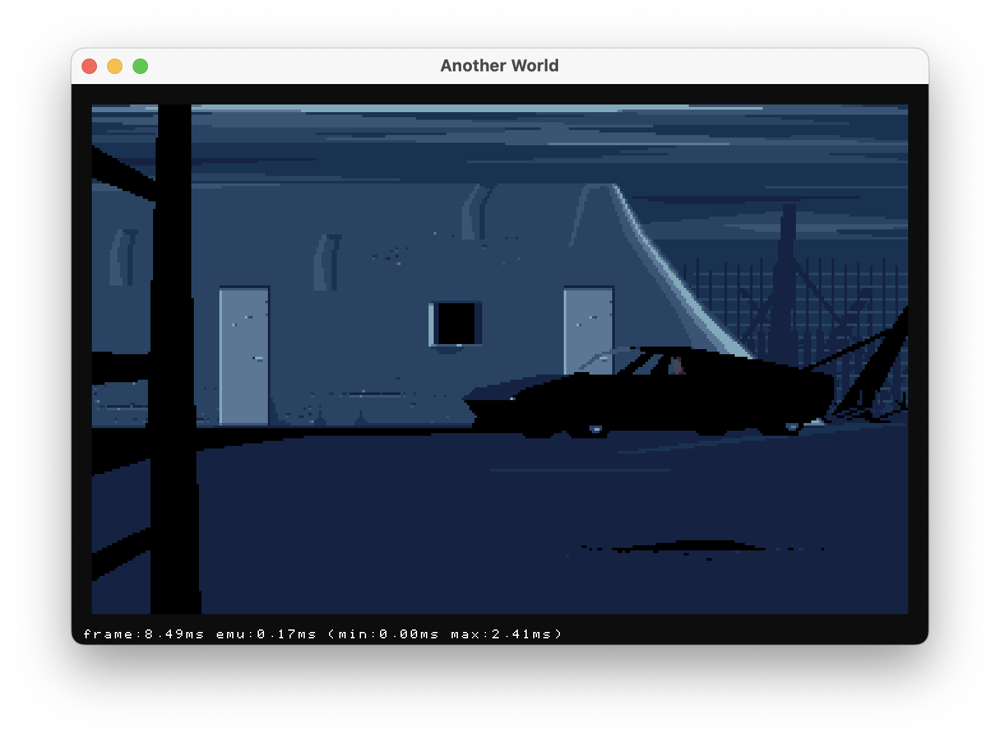

# rawz - Another World Interpreter in Zig

[](https://github.com/scemino/rawz/actions/workflows/main.yml)

`rawz` is a re-implementation of the engine used in the game Another World.



## Supported Versions

The program requires the original data files.

- Amiga (Bank*)
- Atari (Bank*)
- DOS (Bank*, memlist.bin)
- DOS demo (Demo*, memlist.bin)

## Build & Run

On `macOS`, `Windows` and `Linux` just run:

`zig build run`

To build and run the web version:

`zig build --release=small -Dtarget=wasm32-emscripten run`

## Command line arguments

```text
    -h, --help
            Display this help and exit.
    -p, --part <PART>
            Game part to start from (0-35 or 16001-16009)
    -e, --ega
            Use EGA palette with DOS version
    -l, --lang <LANG>
            Language (fr,us)
        --protec
            Enable game protection
        --fullscreen
            Start in fullscreen mode
    <PATH>
            Path to the game data (directory or tar archive)
```

In game hotkeys :

```text
  Arrow Keys      move Lester
  Enter/Space     run/shoot
  C               enter a code to start at a specific position
```

## Credits

- **Gregory Montoir** for his awesome project [rawgl](https://github.com/cyxx/rawgl)
- **flooh** for his library [sokol-zig](https://github.com/floooh/sokol-zig)
- **Omar** for [dearimgui](https://github.com/ocornut/imgui)
- **Eric Chahi** for [Another world](http://www.anotherworld.fr/another_world.htm)